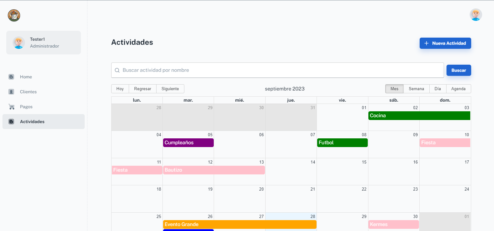

# BagApp

BagApp es una aplicación de gestión que ofrece funcionalidades para tres roles diferentes: Administrador, Usuario y Cliente. El sistema está compuesto por cuatro módulos principales: Home, Pagos, Clientes y Actividades.

## Descripción

BagApp es una aplicación web que proporciona una experiencia de usuario eficiente y amigable para la gestión de actividades y pagos. La aplicación se basa en componentes de Material-UI y utiliza la biblioteca React para ofrecer una interfaz moderna y receptiva.

## Captura de Pantalla

## Características Destacadas

- **Gestión de Roles:** BagApp ofrece funcionalidades específicas para tres roles diferentes: Administrador, Usuario y Cliente.

- **Módulos Clave:** La aplicación se divide en cuatro módulos principales que abordan las necesidades esenciales: Home, Pagos, Clientes y Actividades.

- **Requisitos:**
  - Se recomienda Node.js 16.x y npm 6+ (se sugiere v16.15.0).
  - Instale las dependencias: `npm install` o `yarn install`.
  - Inicie el proyecto: `npm run start` o `yarn start`.

## Contáctenos

Si tiene alguna pregunta o necesita ayuda, no dude en ponerse en contacto con nosotros por correo electrónico: [aroldol005@gmail.com].
